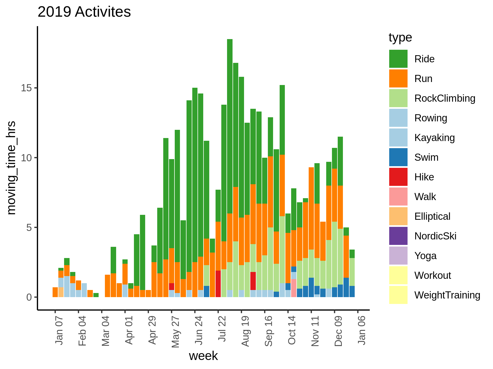

# Strava

Having fun plotting my activity data from [Strava](http://bit.ly/strava-kelly)!

## Dependencies

Most dependencies are listed in the [conda](https://docs.conda.io/projects/conda/en/latest/index.html) environment file: [`config/env.yml`](config/env.yml).

Additional dependencies not available in conda:

- [rStrava](https://github.com/fawda123/rStrava)
- [googleway](https://cran.r-project.org/package=googleway)
- [googlePolylines](https://cran.r-project.org/package=googlePolylines)
- dev version of [lubridate](https://github.com/tidyverse/lubridate)

## Workflow

### Run everything
```
snakemake
```
See the [snakemake documentation](https://snakemake.readthedocs.io/en/stable/) for more on how to use snakemake.

### View the workflow DAG
```
snakemake -n --forceall --dag | dot -Tsvg > figures/dag.svg
```


## Plots





