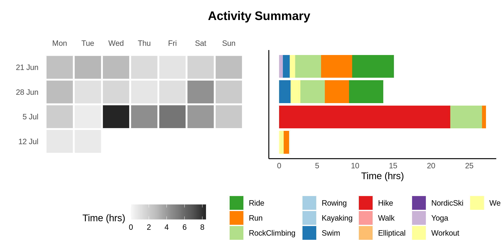
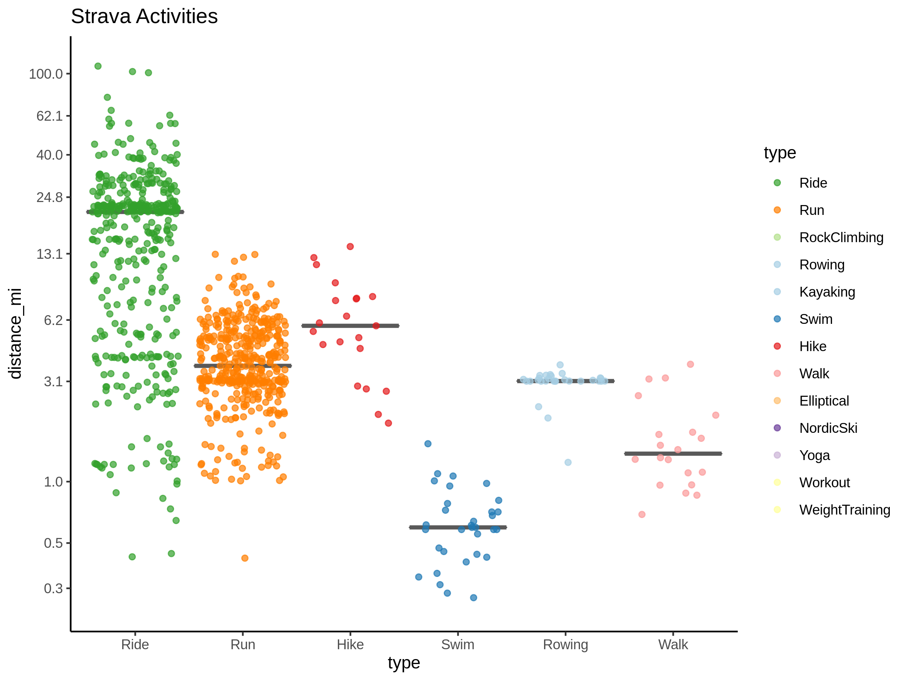
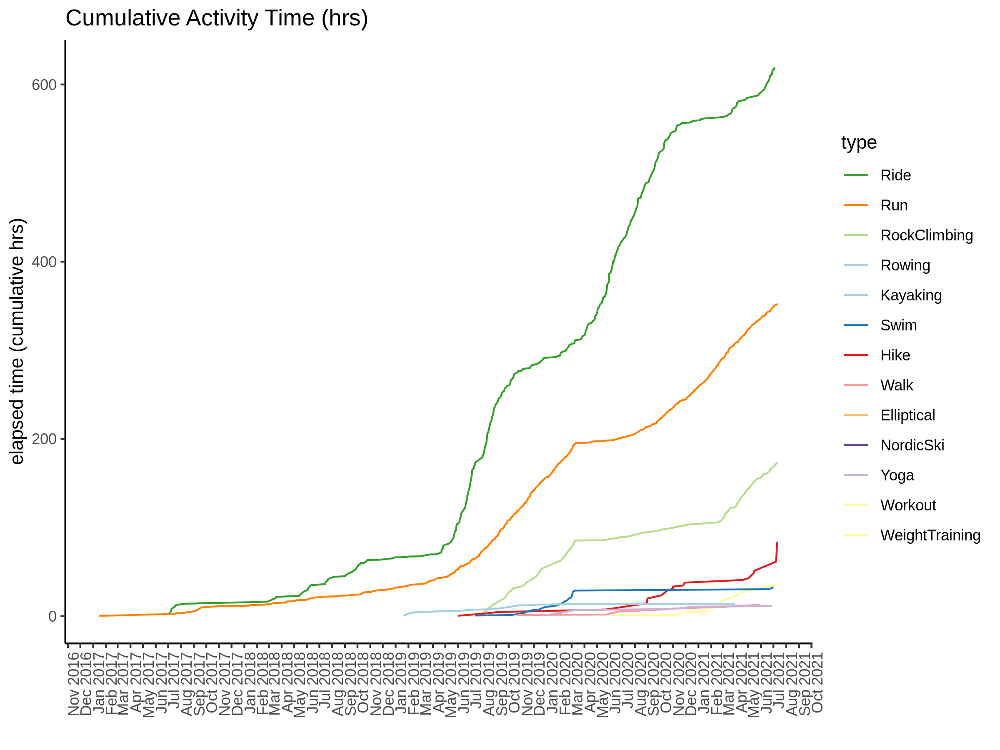
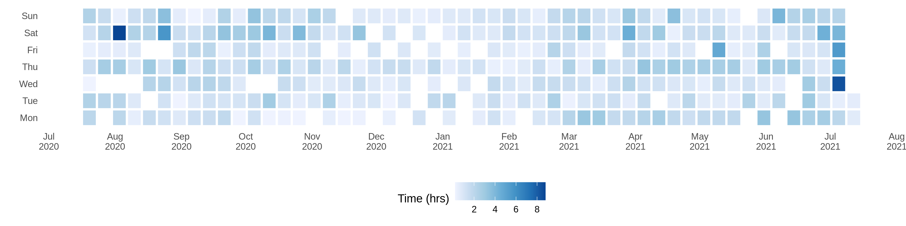

# Strava
[](https://github.com/kelly-sovacool/strava/actions)

Having fun plotting my activity data from [Strava](http://bit.ly/strava-kelly)!

## Dependencies

Most dependencies are listed in the [conda](https://docs.conda.io/projects/conda/en/latest/index.html) environment file: [`environment.yml`](environment.yml).

Additional dependencies not available in conda:

- [rStrava](https://github.com/fawda123/rStrava)
- [googleway](https://cran.r-project.org/package=googleway)
- [googlePolylines](https://cran.r-project.org/package=googlePolylines)
- dev version of [lubridate](https://github.com/tidyverse/lubridate)

## Setup

Follow the instructions in the [rStrava documentation](https://github.com/fawda123/rStrava#api-functions-token) to
generate an API token to access your strava data.

Once you have an API token cached as an R data file in `.httr-oath`, you're ready to run this workflow.
Be sure not to commit your token to GitHub!

## Workflow

Run everything:
```
snakemake
```
See the [snakemake documentation](https://snakemake.readthedocs.io/en/stable/) for more on how to use snakemake.

View the workflow DAG:
```
snakemake -n --forceall --dag | dot -Tsvg > figures/dag.svg
```


The [R Markdown report](code/report.Rmd) is rendered to the [docs](docs) directory:
view the rendered html [here](https://sovacool.dev/strava/report.html).

## Example plots

See all plots in the [figures](figures/) directory











